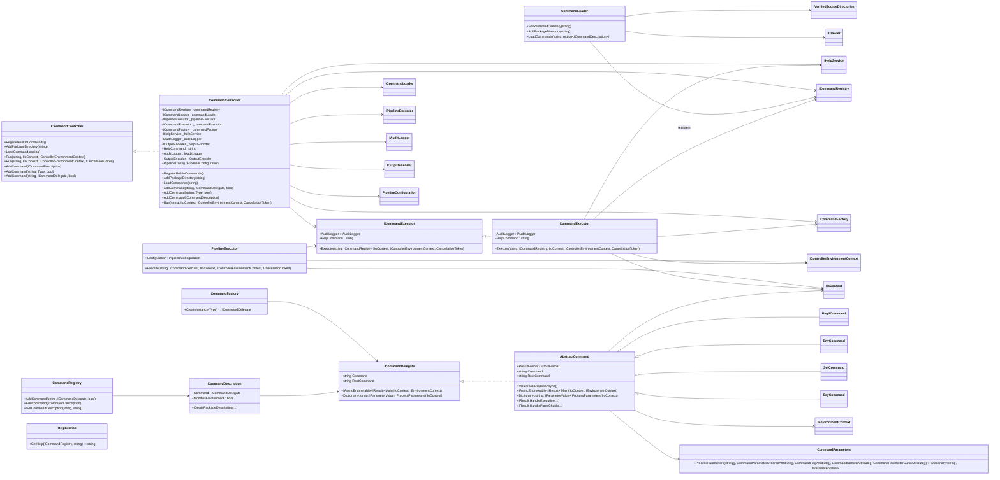

# Xcaciv.Command - Class Diagram

```mermaid
classDiagram
    direction LR

    class ICommandController {
        +RegisterBuiltInCommands()
        +AddPackageDirectory(string)
        +LoadCommands(string)
        +Run(string, IIoContext, IControllerEnvironmentContext)
        +Run(string, IIoContext, IControllerEnvironmentContext, CancellationToken)
        +AddCommand(ICommandDescription)
        +AddCommand(string, Type, bool)
        +AddCommand(string, ICommandDelegate, bool)
    }

    class CommandController {
        -ICommandRegistry _commandRegistry
        -ICommandLoader _commandLoader
        -IPipelineExecutor _pipelineExecutor
        -ICommandExecutor _commandExecutor
        -ICommandFactory _commandFactory
        -IHelpService _helpService
        -IAuditLogger _auditLogger
        -IOutputEncoder _outputEncoder
        +HelpCommand : string
        +AuditLogger : IAuditLogger
        +OutputEncoder : IOutputEncoder
        +PipelineConfig : PipelineConfiguration
        +RegisterBuiltInCommands()
        +AddPackageDirectory(string)
        +LoadCommands(string)
        +AddCommand(string, ICommandDelegate, bool)
        +AddCommand(string, Type, bool)
        +AddCommand(ICommandDescription)
        +Run(string, IIoContext, IControllerEnvironmentContext, CancellationToken)
    }

    class ICommandDelegate {
        +string Command
        +string RootCommand
        +IAsyncEnumerable~IResult<string>~ Main(IIoContext, IEnvironmentContext)
        +Dictionary~string, IParameterValue~ ProcessParameters(IIoContext)
    }

    class AbstractCommand {
        +ResultFormat OutputFormat
        +string Command
        +string RootCommand
        +ValueTask DisposeAsync()
        +IAsyncEnumerable~IResult<string>~ Main(IIoContext, IEnvironmentContext)
        +Dictionary~string, IParameterValue~ ProcessParameters(IIoContext)
        +IResult<string> HandleExecution(...)
        +IResult<string> HandlePipedChunk(...)
    }

    class CommandRegistry {
        +AddCommand(string, ICommandDelegate, bool)
        +AddCommand(ICommandDescription)
        +GetCommandDescription(string, string)
    }

    class CommandLoader {
        +SetRestrictedDirectory(string)
        +AddPackageDirectory(string)
        +LoadCommands(string, Action~ICommandDescription~)
    }

    class PipelineExecutor {
        +Configuration : PipelineConfiguration
        +Execute(string, ICommandExecutor, IIoContext, IControllerEnvironmentContext, CancellationToken)
    }

    class ICommandExecutor {
        +AuditLogger : IAuditLogger
        +HelpCommand : string
        +Execute(string, ICommandRegistry, IIoContext, IControllerEnvironmentContext, CancellationToken)
    }

    class CommandExecutor {
        +AuditLogger : IAuditLogger
        +HelpCommand : string
        +Execute(string, ICommandRegistry, IIoContext, IControllerEnvironmentContext, CancellationToken)
    }

    class CommandFactory {
        +CreateInstance(Type) : ICommandDelegate
    }

    class HelpService {
        +GetHelp(ICommandRegistry, string) : string
    }

    class CommandParameters {
        +ProcessParameters(string[], CommandParameterOrderedAttribute[], CommandFlagAttribute[], CommandNamedAttribute[], CommandParameterSuffixAttribute[]) : Dictionary~string, IParameterValue~
    }

    class CommandDescription {
        +CreatePackageDescription(...)
        +Command : ICommandDelegate
        +ModifiesEnvironment : bool
    }

    %% Interfaces & abstractions
    ICommandController <|.. CommandController
    ICommandDelegate <|.. AbstractCommand
    ICommandExecutor <|.. CommandExecutor

    %% Controller dependencies
    CommandController --> ICommandRegistry
    CommandController --> ICommandLoader
    CommandController --> IPipelineExecutor
    CommandController --> ICommandExecutor
    CommandController --> ICommandFactory
    CommandController --> IHelpService
    CommandController --> IAuditLogger
    CommandController --> IOutputEncoder
    CommandController --> PipelineConfiguration

    %% Loader dependencies
    CommandLoader --> ICrawler
    CommandLoader --> IVerifiedSourceDirectories
    CommandLoader --> ICommandRegistry : registers

    %% Execution pipeline
    PipelineExecutor --> ICommandExecutor
    PipelineExecutor --> IIoContext
    PipelineExecutor --> IControllerEnvironmentContext

    %% Executor dependencies
    CommandExecutor --> ICommandRegistry
    CommandExecutor --> ICommandFactory
    CommandExecutor --> IHelpService
    CommandExecutor --> IIoContext
    CommandExecutor --> IControllerEnvironmentContext

    %% Factory creates commands
    CommandFactory --> ICommandDelegate

    %% Registry holds descriptions
    CommandRegistry --> CommandDescription
    CommandDescription --> ICommandDelegate

    %% Commands
    AbstractCommand --> CommandParameters
    AbstractCommand --> IIoContext
    AbstractCommand --> IEnvironmentContext

    %% Built-in commands implement ICommandDelegate via AbstractCommand
    class SayCommand
    class SetCommand
    class EnvCommand
    class RegifCommand
    AbstractCommand <|-- SayCommand
    AbstractCommand <|-- SetCommand
    AbstractCommand <|-- EnvCommand
    AbstractCommand <|-- RegifCommand
```
